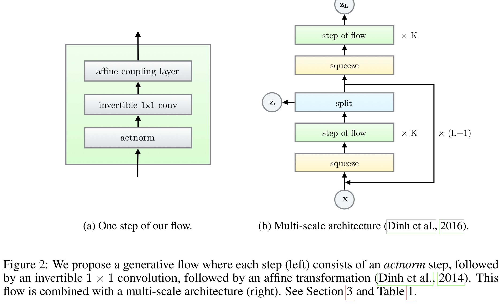
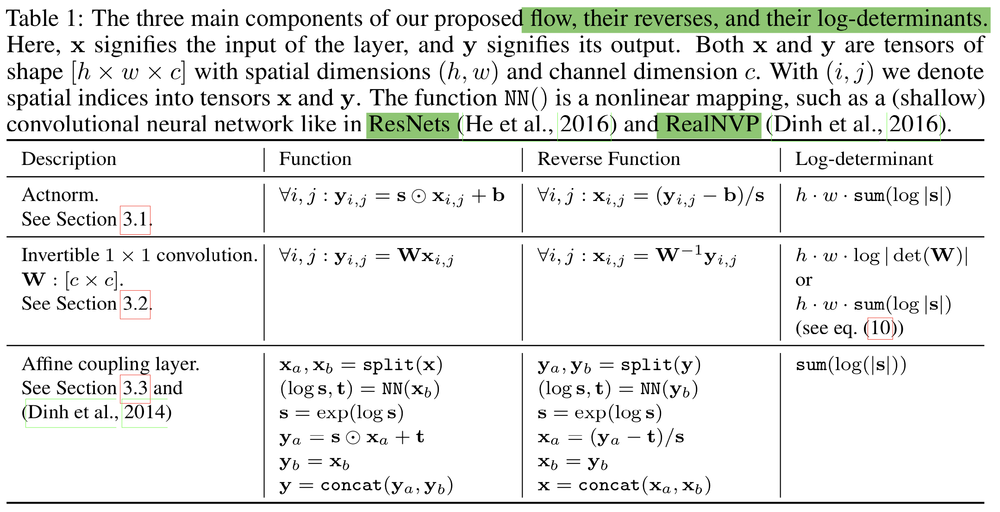
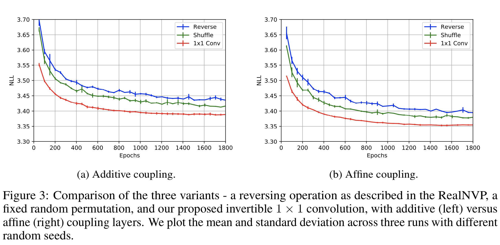

# 《Glow : Generative Flow with Invertible 1*1 Convolutions》 Note

- 论文下载地址：https://d4mucfpksywv.cloudfront.net/research-covers/glow/paper/glow.pdf
- 代码地址： https://github.com/openai/glow

## Abstract
基于流的生成模型由于以下原因而具有概念上的吸引力：精确对数似然性的可跟踪性、精确的变量推断的可跟踪性、训练和综合的可并行性。

在这篇文章中，作者提出了基于可逆的1*1卷积网络的生成流模型，在标准基准数据集上的对数似然性有了显著提升。

优化的模型可以有效逼真地对大图像进行合成和操作。

- Note： Log-likelihood    

> 似然函数是在给定输出x时，参数b的似然函数L(b|x)在数值上等于给定b时X=x的概率，L(b|x)=P(X=x|b)

> 对数似然函数是对似然函数求对数，在不改变函数增减性的基础上来简化计算。

Introduction
在机器学习领域还未解决的两大主要问题：

（1）数据效率：从少量数据中学习的能力；

（2）一般化：当目标或者是上下文改变时的鲁棒性

> 鲁棒性：指控制系统在一定（结构、大小）参数的摄动下，维持其他某些性能的特性。

### 生成模型解决这些问题的方法：

（1）学习真实的世界模型

（2）人工监督很少或者无监督时，从输入中学习有意义的特征

生成建模学科的研究在基于似然的模型和GANs上取得了巨大的飞跃

-----
## 实验思路

### 1. 基于似然的方法

#### （1）自回归模型（AR模型）

是统计上一种处理时间序列的方法，例如，用{\color{Green} x_{1}-x_{t-1}}来预测{\color{Green} x_{t}}的表现，并假设它们为一线性关系，在这个方法中是用x来预测x，所以叫做自回归。函数表达式为：$\color{red} x_{t}=c+\sum_{i=1}^{p}\psi _{i}x_{t-i}+\varepsilon _{t}$

自回归模型的优点是比较简单，缺点是合成时可并行性存在限制，计算长度和数据维度成比例，若处理大型图像或者视频比较麻烦。

#### （2）变分自编码器（VAEs）

通过查阅资料，我所理解的变分自编码器的基本思路是：将输入数据x通过编码器计算得到其均值和方差，然后将方差添加噪声后强度接近于1，均值接近于0，构成正态分布，然后从此正态分布中采样得到z，将z通过解码器后得到x'，令x'无限逼近于x。

#### （3）NICE 非线性独立分量估计

NICE是为了对复杂的高维数据进行非线性变换，将高维数据映射到潜在空间，产生独立的潜在变量

#### （4）RealNVP 实值非体积保持

RealNVP是在NICE的基础上，将分层和组合变换的思想进一步延伸，采用了仿射耦合和多尺度框架，所谓多尺度框架就是通过不同尺度、潜在变量映射到最终的潜在空间。

### 2. 生成对抗性网络GAN

GAN是无监督学习的范畴，是由生成模型和判别模型的相互博弈学习来产生相当好的输出，生成模型用来接收随机噪声，通过这些噪声生成图片，判别模型是用来判断生成的图片是不是真实的，输出图片是真实图片的概率。训练时，生成网络G的目标就是尽量生成真实的图片去欺骗判别网络D，而D的目标就是尽量把G生成的图片和真实的图片分开。

- 应用：GAN常用于图像生成，如超分辨率任务、语义分割等，数据增强，数据分类等。

## Generative Flow
Flow模型的多尺度结构图和每一步结构图如下：

可以看到整个模型分为 (a) 和 (b)，其实 (a) 只是对 (b) 中的“step of flow”的展开。其中，（a）模型的每部分操作具体如下所示：

Actnorm 层，全称为 Activation Normalization 翻译为激活标准化，整体的作用类似于批归一化，也就是对输入的数据做预处理，Actnorm 使用每个通道的标度和偏差参数执行激活的仿射变换，类似于批量标准化，初始化这些参数，使得在给定初始数据小批量的情况下，每个通道的后行为动作具有零均值和单位方差。初始化后，标度和偏差被视为与数据无关的常规可训练参数。

可逆 1×1 卷积层，该层是用来替换在NICE 和 RealNVP 是反转通道的排序的固定装置，其中权重矩阵被初始化为随机旋转矩阵，卷积层的输入和输出通道数量是相同的。

> 1. LU分解：LU分解是将一个矩阵分解为一个单位下三角矩阵和一个上三角矩阵的乘积（有时候是它们和一个置换矩阵的乘积）

> 2. 张量：定义由若干坐标系改变时满足一定坐标转化关系的有序数组组成的集合为张量，0维张量就是标量，1维张量是向量，2维张量是矩阵，以此类推。

### 仿射耦合层：

零初始化：用零初始化每个 NN () 的最后一个卷积，使得每个仿射耦合层最初执行一个同一性函数，这有助于训练深层网络。 

拆分和连接：split () 函数将输入张量沿通道维度分成两半，而concat () 操作执行相应的反向操作：连接成单个张量。 Glow 中只沿通道维度执行拆分，简化了整体架构。 

排列：上面的每个流程步骤之前都应该对变量进行某种排列，以确保在充分的流程步骤之后，每个维度都可以影响其他每个维度。 NICE 完成的排列类型是在执行加性耦合层之前简单地反转通道（特征）的排序；RealNVP 是执行（固定）随机排列；Glow 则是采用可逆 1 x 1 卷积。

## 实验
实验的开篇是比较 Glow 和 RealNVP，反转操作上 NICE 采用反转，RealNVP 采用固定随机排列，Glow 采用可逆 1 × 1 卷积，并且耦合方式也影响实验的效果，文章比较了加性耦合层和仿射耦合层的性能差距。通过在 CIFAR-10 数据集的平均负对数似然（每维度的比特）来衡量不同操作的差距，其中所有模型都经过 K = 32 和 L = 3 的训练，实验效果如下图：

可以从上图看出，Glow 采用的方法都取得了较小的平均负对数似然，效果比其他模型要好。

为了验证 RealNVP 和 Glow 整体的框架下的差距，实验进一步扩展，比较了 CIFAR-10，ImageNet 和 LSUN 数据集上两者的差距，在相同预处理下，模型在所有数据集上实现了显着的改进。 

在高分辨率图像的生成上，合成的图像质量和合理性都是很高的，为了对潜在变量插值生成图像，整体的过渡还是相当顺畅的，感觉很自然。

为了生成更多含语义的图像，文章利用了一些标签来监督训练，对于不同人脸属性合成上，生成的效果和过渡都是很自然合理。

退火模型对提高生成也是很重要的环节，文章对比了不同退火参数 T 下的实验效果，合理的 T 的选择对于实验效果还是很重要的。
